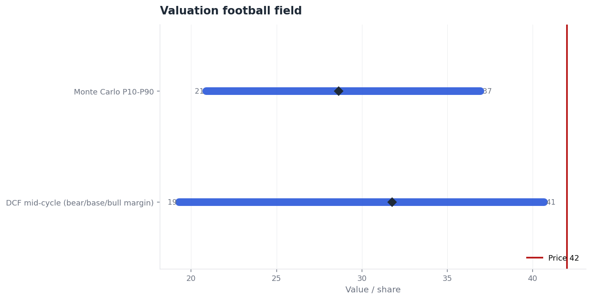
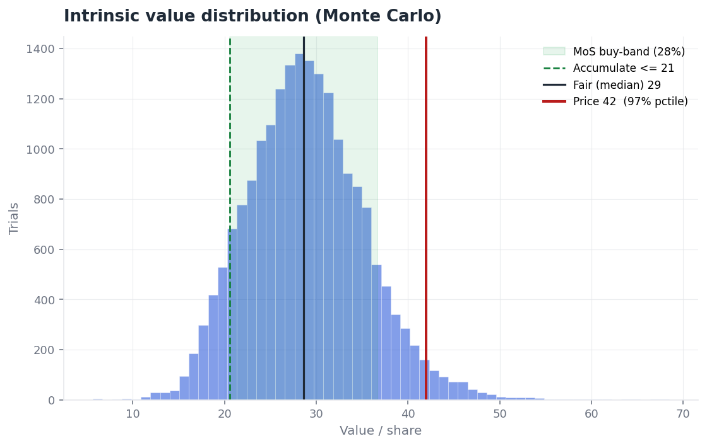

# Freeport-McMoRan (FCX) — Equity Research

**Rating: REDUCE / UNDERWEIGHT · Mid-cycle intrinsic value ≈ $32 · Price ≈ $42 · ~24% downside to normalized value**

Freeport-McMoRan owns one of the best copper franchises on earth, and at roughly $42
it is priced as though the current copper cycle is the permanent state of the world.
Valued on **through-cycle, normalized** economics — a mid-cycle operating margin near
25%, a copper price anchored to its long-run marginal cost rather than the spot tape,
and a capital-heavy reinvestment profile — the business is worth about **$32 per
share**, some 24% below the price. The gap is not a verdict on the orebody, which is
excellent; it is a verdict on *where in the cycle* the price is being struck. A
simulation of the normalized drivers puts the current price at roughly the **97th
percentile** of the value distribution: a bull cycle can carry it there, but the odds
embedded in the price are poor for an owner rather than a trader.

*(Illustrative worked example for the cyclical/commodity archetype, built end-to-end
with this skill's engine on round, defensible inputs. Not a live call on FCX.
Educational analysis, not investment advice.)*

## Copper and the capital cycle

Copper is the textbook cyclical: a price-taker's product whose demand sits downstream
of credit and capital spending — construction, electrical grids, vehicles — and whose
supply arrives in long, lumpy, debt-financed waves. That structure produces the
pattern that defeats most copper valuations: miners commit capacity near the top, when
margins and balance sheets look strongest, and the new tonnes arrive into the
subsequent downturn. Reported margins therefore swing enormously across a cycle — a
copper producer can earn a 30%-plus operating margin at the peak and less than 15% in
the trough — and capitalizing either extreme as if it were normal is the single most
common error in the sector. The discipline a valuation imposes here is to value the
**average through the cycle**, not the print on the screen.

## Freeport: a low-cost price-taker

Freeport's distinction is asset quality and position on the cost curve: the Grasberg
district in Indonesia and a portfolio of Americas mines give it scale, long reserve
lives, and a cost base in the lower half of the industry. Two features govern the
valuation. First, it is a **price-taker**: it sells an undifferentiated commodity at a
global clearing price it does not set, so its margin is the copper price minus a
largely fixed cost base, and it has no pricing power to defend in a downturn. Second,
mining is **capital-heavy** — sustaining and developing these orebodies consumes
roughly a dollar of capital for every fifty-five cents of revenue, so reinvestment is a
permanent drag on free cash flow that a high-multiple narrative tends to forget. A
material minority interest at the Indonesian operations sits between enterprise value
and the equity, and must be subtracted rather than waved through.

## Placing the cycle (the normalization point)

Because the whole valuation turns on what "normal" means, the first analytical act is
to **place the cycle**, in the spirit of Dalio's economic machine: locate the asset in
both the short-term business cycle and the longer credit cycle, because copper demand
is credit-financed and moves with them. Late in a credit and capex expansion, copper
prices and producer margins run hot and "normal" looks high; in a deleveraging they run
cold. That placement is what sets the **price deck** — a through-cycle copper price
anchored to the marginal cost of the highest-cost tonne the market needs, not to the
current spot or the forward strip. Feeding the engine a normalized mid-cycle margin
(25%, against a base near 22% and a bull-case 30%) rather than a spot-driven peak is
the operational expression of that placement. Dalio is not a single-stock valuer, and
nothing here borrows his portfolio theory; the contribution is narrower and exact — it
disciplines the one input, the normalization point, that the entire cyclical
valuation rests on.

## Story to numbers

On normalized inputs the four drivers read as follows. Revenue starts near $25bn and
grows in the mid-single digits as volume and a through-cycle price drift up, declining
toward the riskfree rate by year ten. The operating margin normalizes to about 25% — a
mid-cycle figure, explicitly not the peak. Reinvestment is heavy, at a sales-to-capital
ratio near 0.55. Risk is captured by a cost of capital that starts at 10%, reflecting
commodity beta and operating leverage, and drifts toward 8.5%, with a terminal return
on capital of about 10% — a deliberately *thin* durable spread, because commodity
producers rarely compound excess returns for long.

This produces an intrinsic value of about **$32 per share** against the ≈$42 price.
About **63%** of that value sits in the terminal year, and the result is appropriately
sensitive to the normalized margin: a trough-anchored 18% margin yields roughly $19,
while a peak-anchored 30% yields about $41 — the price is near the top of that band.

| Intrinsic valuation (normalized base case) | |
|---|---|
| Through-cycle operating margin | 25% |
| Sales-to-capital (reinvestment) | 0.55 |
| Cost of capital (initial → terminal) | 10.0% → 8.5% |
| Terminal ROC / growth | 10% / 2.5% |
| % of value in terminal | ~63% |
| **Mid-cycle intrinsic value / share** | **≈ $32** |
| Price (illustrative) | ≈ $42 |

## What the price is pricing

Inverting the valuation is more revealing than the point estimate. Holding the other
drivers at their normalized base case, the ≈$42 price implies a **sustained operating
margin near 31%** — held in perpetuity, not for a cycle. That is a peak-cycle margin
treated as the permanent normal, which is precisely the error the through-cycle
discipline exists to prevent. The price is not pricing a plausible average; it is
pricing the good years as if the bad ones do not arrive.

| Year-10 revenue ＼ operating margin | 22% | 30% |
|---|---|---|
| $28bn | $24 | $36 |
| $34bn | $31 | $44 ✓ |
| $40bn | $38 | $52 ✓ |

*(✓ = normalized intrinsic value reaches the ≈$42 price; it requires both high revenue
and a near-peak margin together.)*

## The odds, not just the estimate

Because every input is uncertain — and for a cyclical, *unusually* so — the honest
output is a distribution. Running the normalized drivers as distributions (year-ten
revenue lognormal around $32bn, the operating margin triangular between 15% and 32%,
sales-to-capital between 0.40 and 0.80, and the cost of capital between 8.5% and 13%)
yields a simulated **median value of about $29** per share. The ≈$42 price falls at
roughly the **97th percentile** of that distribution, with only about a 3% chance the
shares are worth more than the price on these assumptions.

That distribution also frames an entry discipline rather than a single number. The
**margin-of-safety buy-band**, which widens with the spread of the distribution,
suggests accumulating only **below about $21**, treating **≈$29** as fair, and
regarding anything **above ≈$37** as rich — a wide band, as a cyclical deserves.

## Judgment

The investing decision follows from the gap between normalized value and price. A
through-cycle intrinsic value near $32, a simulated median around $29, and a price at
roughly the 97th percentile of the value distribution is a reduce signal for a
value-driven owner — and the signal survives an honest mid-cycle case rather than
depending on a trough. Trading is a separate game: copper momentum can run for quarters
on a supply scare or a demand impulse, and a trader should watch the spot price and
inventories rather than normalized value. What the valuation rules out is only the
comfortable belief that today's price reflects a mid-cycle future. It does not.

## What would change this view

The thesis is wrong if the *through-cycle price deck itself* steps up — if
electrification and grid investment structurally lift the marginal cost and the normal
copper price, so that a 30% margin becomes the genuine average rather than the peak.
That is the real bull case, and it belongs in the price deck, not in a higher multiple
on peak earnings. The principal risks on the other side are a credit-cycle downturn
that pulls copper demand and margins below the trough assumption, capacity added across
the industry into weakening demand (the capital cycle turning), and the
Indonesia-specific operating and fiscal terms at Grasberg. The valuation is most
sensitive to the normalized margin and the price deck; a reader who holds a
structurally higher copper price should raise the deck and re-run the model, which is
the point of shipping it.

## Numbers ledger

| Figure | Value | Source / basis | As of |
|---|---|---|---|
| Base revenue | ≈ $25bn | company filings (illustrative) | FY2024 |
| Normalized operating margin | 25% | own estimate, through-cycle average | mid-cycle |
| Sales-to-capital | 0.55 | own estimate from capex intensity | mid-cycle |
| Cost of capital | 10.0% → 8.5% | own estimate (commodity beta) | 2024 |
| Mid-cycle intrinsic value | ≈ $32 | `dcf_valuation.py` on `cyclical.freeport.json` | this run |
| Monte Carlo median / price percentile | ≈ $29 / 97th | `monte_carlo.py`, cyclical distributions | this run |
| Price-implied margin | ≈ 31% | `reverse_dcf.py --solve-for target_operating_margin` | this run |
| Price (illustrative) | ≈ $42 | placeholder, not a market quote | — |

*Analysis for educational purposes, not personalized investment advice. Inputs as of
financial year 2024 and illustrative; the valuation is sensitive to assumptions, the
normalized margin and the copper price deck most of all. Revisit when the cycle
placement changes.*
